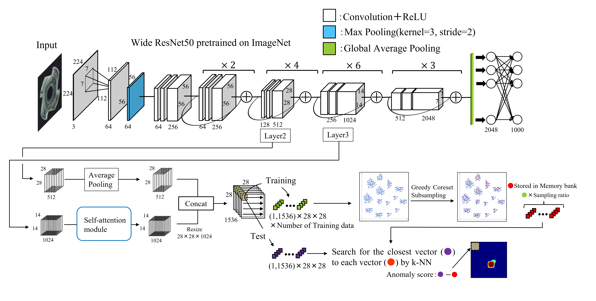
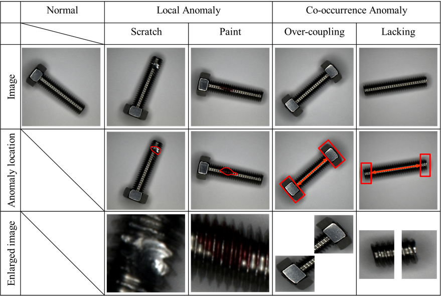

# SA-PatchCore

**This repository is under editting.**

## Co-occurrence-Anomaly-Detection-Screw-Dataset (CAD-SD)

"Co-occurrence Anomaly Detection Screw Dataset (CAD-SD)" for anomaly detection, including local anomalies and co-occurrence anomalies.

**The dataset is available is this [[Link](https://drive.google.com/drive/folders/1yeampzTiB4uoTmmqIZkeCdMIXGujl3cU?usp=sharing)].**

The CAD-SD includes normal images of the product with a hex nut attached to one side of the screw rod. The types of abnormal images in the dataset are roughly divided into the anomalies of the local region and that of the co-occurrence relation. The anomalies of the local area are “Scratch,” in which a portion of the product is scratched, and “Paint,” in which some paint adheres to a part of the product. The anomalies in the co-occurrence relationship are “Over-coupling,” where hex nuts are coupled on both sides of the screw rod, and “Lacking,” where hex nuts are not coupled on either side of the screw rod. There are 400 normal training images. For the evaluation, “Normal,” “Scratch,” “Paint,” “Over-coupling,” and “Lacking” contain 210, 41, 41, 44, and 40 images, respectively. 

### Shooting Environment
The camera used was a DFK33UX183 manufactured by Argo Corporation. The aperture and shooting distance was set at 16 and 25 cm, respectively. The size of the image in the dataset was trimmed from 5472×3648 to 700×700. An HPR2-75SW manufactured by CCS Corporation was used for the lighting, and PD2-5024 (A) was used for the power supply.

